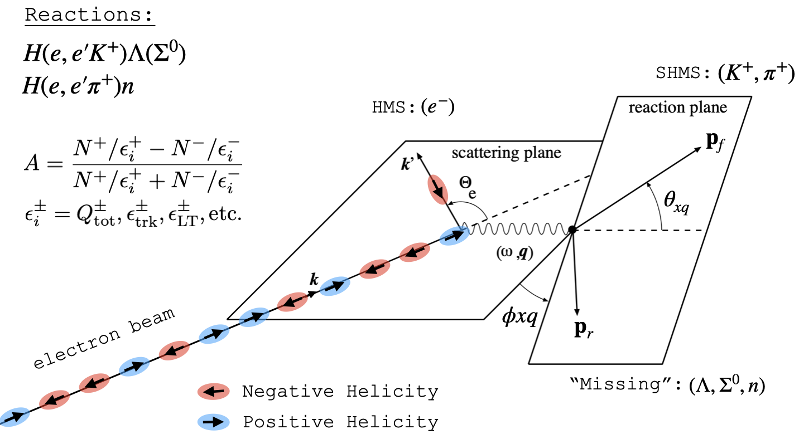

## Hall C Kaon LT (2018) Analysis
This directory contains Helicity Analyzer C++ class, (`helicityAnalyzer.cpp (.h)`) derived from the more generic base Hall C Base Analyzer, `baseAnalyzer.cpp(.h)`, in order to carry out the beam-asymmetry analysis part for the Kaon LT (2018) Hall C Experiment.

**The main nuclear reaction of interest is  **
H(*e, e'h)*X: where the incident beam electron *e* interacts with a hydrogen target atom ( H ) and scatters ( *e'* ) into the HMS where it is detected in coincidence with the knocked-out hadron ( *h* ) in the SHMS, and the missing mass continuum, X, is reconstructed from momentum conservation laws.  

The knocked-out hadron can be selected to be either a Proton, Pion or Kaon,
depending on the analysis to be carried out. The *Missing Mass* spectrum is a continuum of multiple particle, such as: Lambda, Sigma, Eta, neutron etc. 

Figure 1: General coincidence reaction kinematics summarizing the detected and "Missing" particles during the KaonLT 2018. The helicity states are only relevant for the beam-spin asymmetry analysis to be done in parallel with the main KaonLT analysis.

**Data Acquisition (DAQ) Mode**  
During production data-taking, the DAQ was set to COIN MODE (coincidence mode) and the main coincidence trigger used was PTRIG5 = PTRIG1 X PTRIG3 ---> PTRIG5 = ( SHMS 3/4 ) X HMS EL-REAL

**Particle Identification (PID)**  

* HMS (electron) identification is done via a Calorimeter and Gas Cherenkov cuts
* SHMS (hadron) identification is primarily done with a coincidence time cut on the relevant hadron in question
	* **Pion / Kaon Separation**: 	Provided by the Heavy Gas Cherenkov for central momenta P >  3.4 GeV/c. The type of gas/ pressure are configured such that the detector will **NOT** emit Cherenkov radiation (signal) for a Kaon, but it will for a Pion. Usually, a cut on the number of photoelectrons is done ( hgcer_npeSum < 1.5 npe ), for example.
	* **Proton / Kaon Separation**: Provided by the Aerogel Cherenkov for central momenta P > 3 GeV/c. The Aerogel Chereknov is configured such that a signal will be emitted if the particle is a Kaon. A cut on the number of photoelectrons is done, (paero_npeSum > 1.5 npe), for example.
